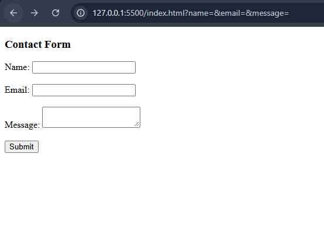
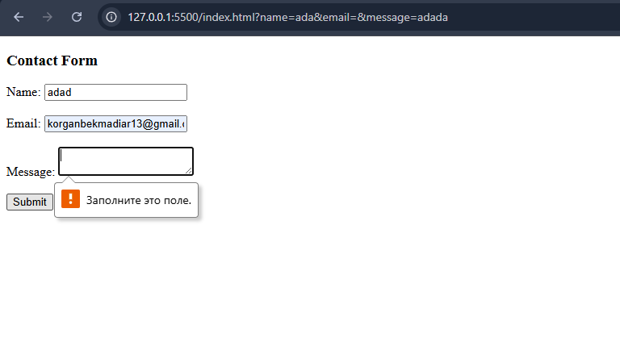
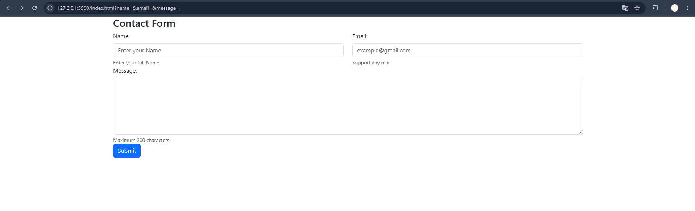
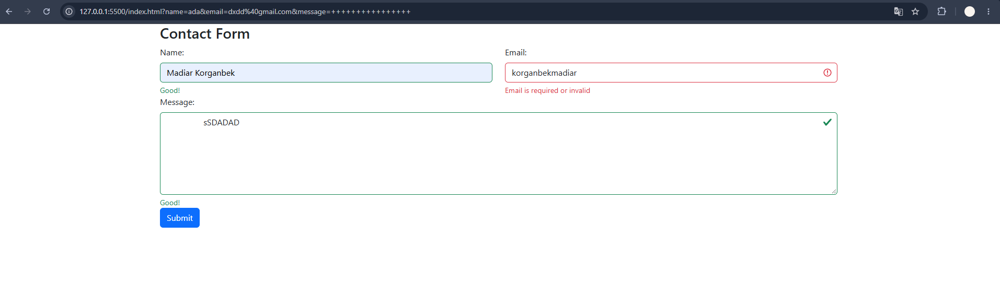
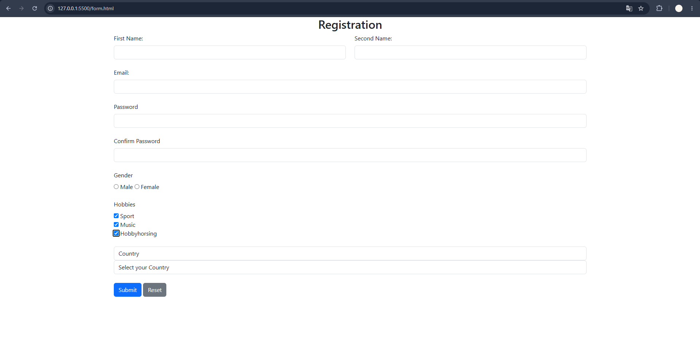

# Assignment 4 - Forms and Validation

## Student Information

Name: Korganbek Madiyar  
Group: IT-2501

# Part 1 - Basic HTML Forms

## Task 0 - Simple Contact Form

I created a basic contact form with a name field, email field, message textarea and submit button. I also added proper labels for all form fields.

## Task 1 - Form with HTML5 Validation

I added HTML5 validation attributes such as `required`, `type="email"`, `maxlength` and `minlength`. The browser checks the entered data and prevents the form from being submitted when the data is incorrect.

# Part 2 - Bootstrap Forms

## Task 2 - Bootstrap Form Styling

I recreated the contact form using Bootstrap classes. I used Bootstrap Grid to arrange the Name and Email fields in columns. I also added placeholders and helper text to make the form more user-friendly.

## Task 3 - Bootstrap Validation Styles

I added Bootstrap validation classes such as `is-valid` and `is-invalid`. I also used `valid-feedback` and `invalid-feedback` to display success and error messages below the form fields.

# Part 3 - Advanced Form Project

## Task 4 - Registration Form

I created a responsive registration form with First Name, Last Name, Email, Password, Confirm Password, Gender, Hobbies and Country fields. I used radio buttons for gender, checkboxes for hobbies and a select dropdown for the country.

I also added Submit and Reset buttons, Bootstrap Grid and HTML5 validation. The password field requires a minimum of 8 characters.

